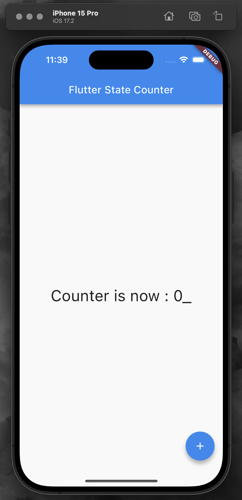

# Text animated counter App

# Flutter 상태 관리 카운터 앱

## 프로젝트 소개

이 앱은 Flutter의 `text animated kit` 패키지를 활용하여 만든 간단한 카운터 앱입니다. 사용자가 버튼을 누를 때마다 카운터의 숫자가 증가하며, 이 숫자는 애니메이션 효과와 함께 화면에 표시됩니다. 

## 기능 설명

- **카운터 기능**: 화면에 있는 ‘+’ 버튼을 통해 카운터 값을 증가시킬 수 있습니다.

- **애니메이션 효과**: 카운터 값이 변할 때마다 `text animated kit` 패키지에 의해 숫자가 부드럽게 변경됩니다.

## 기술적 구현

- **Flutter**: 크로스 플랫폼 지원을 위해 Flutter 프레임워크를 사용하였습니다.

- **애니메이션**: `text animated kit` 패키지를 사용하여 숫자가 변경될 때 매끄러운 텍스트 애니메이션을 구현했습니다.

