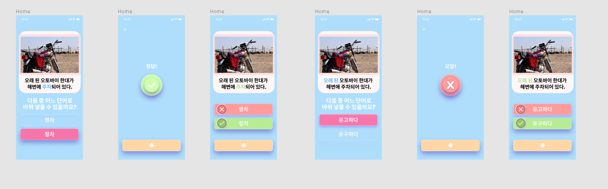

# [I15](https://github.com/elliekim9881/AIFFELthon_I15)
**언어적 능력 형성 시기에 있는 아동들을 대상의 문해력 향상을 위한
스마트기기 잠금 화면 어플리케이션**


## 서비스 언어
**한글(Korean)**<br>
koCLIP + ko-gpt2 를 사용한 한글 이미지 캡셔닝 데이터를 생성하였다.

## 기술 스택 : Python, Flutter, GCP


## 어플리케이션 동작 구성
- 시퀀스 다이어그램
  
- koCLIP + ko-gpt2 를 사용한 이미지 캡셔닝 데이터를 기반으로 문해력 향상을 위한 문제를 생성한다.
1. 클라이언트에서 어플이 실행되면 무작위 이미지 데이터를 선정한다.
2. 선정된 이미지의 캡션 데이터를 조합한 프롬프트를 OpenAI API로 전송한다. OpenAI API로부터 생성된 퀴즈 데이터를 전송받아 DB에 저장한다.
3. 클라이언트에 퀴즈화면을 전송한다.
4. 정오답을 체크한다.
   
## [koCLIP + ko-gpt2 를 사용한 이미지 캡셔닝 데이터 생성](https://github.com/elliekim9881/AIFFELthon_I15/tree/main/model_i15/koCLIP_gpt)
- [koCLIP](https://huggingface.co/koclip) 과 GPT2를 활용하여 이미지 한글 캡션 모델을 훈련시켰다.([참고 모델](https://www.reddit.com/r/MachineLearning/comments/q3xon8/p_fast_and_simple_image_captioning_model_using/)) 해당 모델 훈련을 위해 [MSCOCO dataset](https://cocodataset.org/#home) 전체와 [KETI의 한국어 영상 캡셔닝 데이터셋](https://aihub.or.kr/aihubdata/data/view.do?currMenu=120&topMenu=100&aihubDataSe=extrldata&dataSetSn=261)을 사용하였다. <br>
  해당 모델을 기반으로 빔 탐색 알고리즘을 활용하여 문제 생성을 위한 한글 캡션 데이터를 생성하였다.<br><br>
  <br><br>
  *빔 탐색 알고리즘*
  > 캡션의 후보를 동시에 고려하면서 최적의 캡션을 선택하는 방식이므로 정확성이 중요한 상황이나 높은 품질의 캡션을 필요로 하는 경우에 적합함

  
## [프롬프트 엔지니어링](https://github.com/elliekim9881/AIFFELthon_I15/tree/main/quiz_i15/Setquestion_prompt)
- 프롬프트에 작업 지시문과 하나 이상의 입출력 예시를 함께 포함시키는 "Few-shot" prompting기법을 사용했다. [OpenAI Documentation 참조](https://platform.openai.com/docs/quickstart/add-some-examples?ref=seongjin.me&context=python)<br>
  ```
    To support students with lower literacy skills, I'm creating specialized questions.
    Each question will focus on substituting a word from a provided sentence.
    Both the correct answer and an incorrect alternative will be given.

    Procedure for Creating Each Question:
    1. Select a sentence.
    2. Choose a key word from the sentence.
    3. Identify a word that correctly substitutes the key word (Correct Answer).
    4. Think of a word that is an incorrect substitute for the key word (Incorrect Answer).

    For example:
    Question 1:
    Caption : "오래된 오토바이 한대가 해변에 주차되어있다.",
    Key Word : "주차",
    Correct : "정차",
    Incorrect : "영차"

    Create two questions in Python dictionary format using different key words from the following caption:
    Caption: '''{caption}'''
  ```
- 결과물 품질 향상을 위해 parameter tuning 을 진행하였다. 적절한 temperature, top_p, frequency_penalty, presence_penalty 파라미터 값을 주어서 GPT를 통해 생성되는 응답에 창의성, 다양성, 반복성 등을 조정하였다.
    ```
    parameters = {
    "temperature": 0.7,
    "top_p": 0.7,
    "frequency_penalty": 0.5,
    "presence_penalty": 0.55,
    "max_tokens": 2048
    }
    ```
- temperature 값은 상대적으로 높게 가져가며 창의적으로 문제를 선정하도록 하였고, 조절하며 한 문장에서 두가지 key word를 골라 문제를 생성하는 과정이 매끄럽게 동작하면서 동일한 단어를 너무 빈번하게 반복하지 않도록 frequency_penalty, presence_penalty를 조정하였다. [OpenAI API 공식문서 참조](https://platform.openai.com/docs/api-reference/chat/create?ref=seongjin.me)

- 프롬프트의 동작 시간 및 입출력 제어를 위해 gpt-3.5-turbo-0613에서 지원하고 있는 Function Calling을 사용하였다. 동작시간을 20초 내외로 10초가량 단축시키고 json 형식으로 일관된 응답을 얻을 수 있었다.
- 아래는 사용한 데이터 스키마와 생성된 결과이다.
  ```
  quiz_data_schema = {
  "type": "object",
  "properties": {
    "question1": {
      "type": "object",
      "properties": {
        "caption": {
          "type": "string",
          "description": "The caption describing the scenario or context of question 1."
        },
        "key_word": {
          "type": "string",
          "description": "The key word or phrase that is the focus of question 1."
        },
        "options": {
          "type": "object",
          "properties": {
            "correct_answer": {
              "type": "string",
              "description": "The correct answer for the key word of question 1."
            },
            "incorrect_answer": {
              "type": "string",
              "description": "An incorrect answer alternative for the key word of question 1."
            }
          },
          "required": ["correct_answer", "incorrect_answer"]
        }
      },
      "required": ["caption", "key_word", "options"]
    },
    "question2": {
      "type": "object",
      "properties": {
        "caption": {
          "type": "string",
          "description": "The caption describing the scenario or context of question 2."
        },
        "key_word": {
          "type": "string",
          "description": "The key word or phrase that is the focus of question 2."
        },
        "options": {
          "type": "object",
          "properties": {
            "correct_answer": {
              "type": "string",
              "description": "The correct answer for the key word of question 2."
            },
            "incorrect_answer": {
              "type": "string",
              "description": "An incorrect answer alternative for the key word of question 2."
            }
          },
          "required": ["correct_answer", "incorrect_answer"]
        }
      },
      "required": ["caption", "key_word", "options"]
    }
  },
  "required": ["question1", "question2"]
    }
  ```
  ```
    setquestion = {
  "question1": {
    "caption": "두 남자가 나란히 서 있는 오래 된 사진 세트",
    "key_word": "나란히",
    "options": {
      "correct_answer": "병렬로",
      "incorrect_answer": "따로"
    }
  },
  "question2": {
    "caption": "두 남자가 나란히 서 있는 오래 된 사진 세트",
    "key_word": "오래 된",
    "options": {
      "correct_answer": "오래된",
      "incorrect_answer": "새로운"
    }
  }
    }
    setquestion type = <class 'str'>
  ```

  ## project members
  [**전요한**](https://github.com/753x)
  [**김소연**](https://github.com/elliekim9881)
  [**이진영**](https://github.com/Jinyoung9393)
  [**이윤상**](https://github.com/lys678)